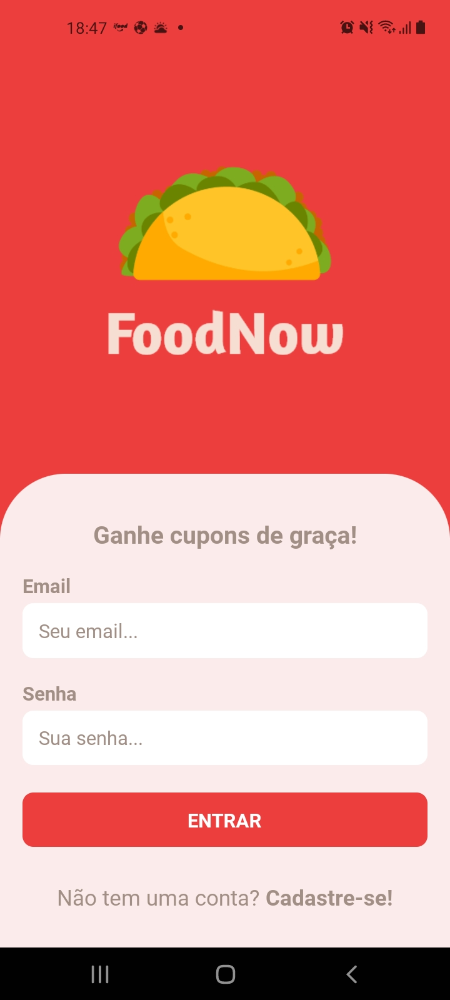
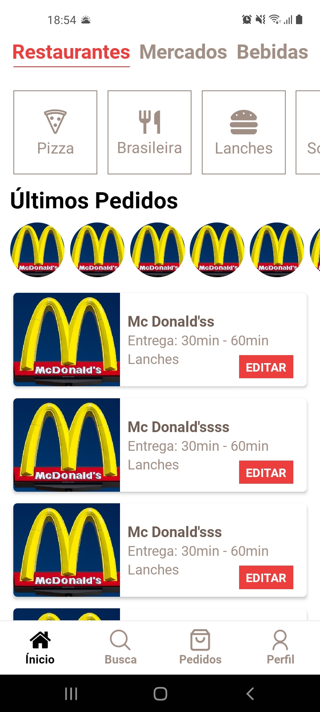
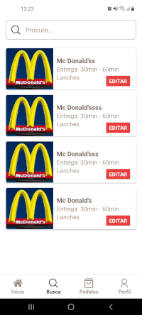

  

A delivery app, made with React Native 💜

<h1 align="center">FoodNow</h1>

## Project Status :construction:
- FoodNow | Project complete :white_check_mark:

## Demonstration

 
  

## Technologies used :scroll:
- <a href="https://developer.mozilla.org/pt-BR/docs/Web/HTML">HTML</a>
- <a href="https://developer.mozilla.org/pt-BR/docs/Web/CSS">CSS</a>
- <a href="https://developer.mozilla.org/pt-BR/docs/Web/JavaScript">JS</a>

## License :white_check_mark:

- MIT License, <a href="./LICENSE">read more<a/>.

luisspassos &copy; 2021.

