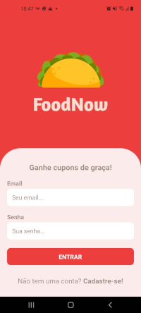

  

A delivery app, made with React Native 💜

<h1 align="center">FoodNow</h1>

## Project Status :construction:
- FoodNow | Project complete :white_check_mark:

## Demonstration

 
   

## Technologies used :scroll:
- <a href="https://reactnative.dev/">React Native</a>
- <a href="https://docs.expo.dev/">Expo</a>
- <a href="https://firebase.google.com/?hl=pt">Firebase</a>
- <a href="https://docs.expo.dev/bare/exploring-bare-workflow/">Bare Workflow</a>
- <a href="https://github.com/expo/google-fonts">Expo Google Fonts</a>
- <a href="https://reactjs.org/">React</a>
- <a href="https://reactnavigation.org/">React Navigation</a>

## License :white_check_mark:

- MIT License, <a href="./LICENSE">read more<a/>.

luisspassos &copy; 2021.

